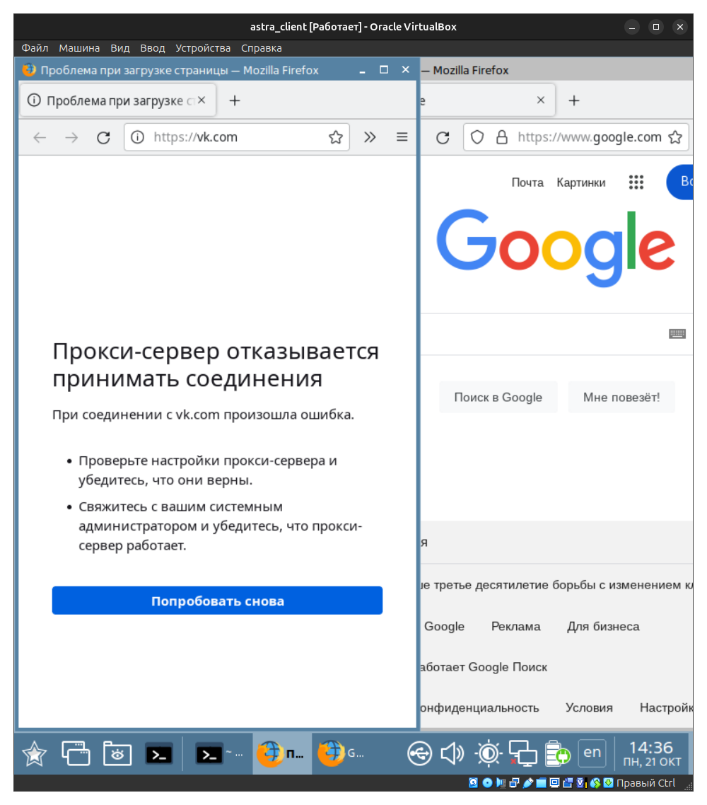

# Web server, Firewall, Proxy server

## Prerequirement

```bash
sudo apt install netcat
sudo apt install nginx
sudo apt install squid
```

## 1. HTTPS request

1. Make an HTTP request for a page with information about TCP/IP network located at `lib.ru/unixhelp/network.txt`. Save the HTTP response.

    ```bash
    echo -e "GET http://lib.ru/unixhelp/network.txt HTTP/1.1\n\n" | nc lib.ru 80 >> ~/network.html
    ```

2. Open the network.html file using browser and make sure that the text is formatted correctly.

    ```bash
    firefox ~/network.html
    ```
    
    

## 2. Nginx web server

0. Check that Nginx is active

    ```bash
    sudo systemctl status nginx.service
    firefox localhost
    ```
    
    

    Creating configuration backup:
    
    ```bash
    sudo cp /etc/nginx/nginx.conf /etc/nginx/nginx.conf.orig
    ```

1. Create an HTML file in the directory /var/www/site/.

    ```bash
    sudo mkdir /var/www/site 
    sudo nano /var/www/site/site.html
    ```

2. Install the Nginx web server and configure it. When making an HTTP request, it should send the HTML file you created.


    ```bash
    sudo nano /etc/nginx/nginx.conf
    ```

    ```bash
    user www-data;
    worker_processes auto;
    pid /run/nginx.pid;
    
    events {
        worker_connections 10;
    }
    
    http {
        sendfile on;
        tcp_nopush on;
        tcp_nodelay on;
        keepalive_timeout 60;
        access_log /var/www/site/access.log;
        error_log /var/www/site/error.log;
        
        server {
            listen 80 default_server;
            root /var/www/site;
            index site.html;
            server_name site.iav.miet.stu;
        }
    }
    ```

    You should replace `www-data` by your username!


    Checking the config for errors:
    
    ```bash
    sudo nginx -t
    ```

    You will see the following if there are no errors:
    ```bash
    nginx: the configuration file /etc/nginx/nginx.conf syntax is ok
    nginx: configuration file /etc/nginx/nginx.conf test is successful
    ```

    Now restart nginx daemon:
    ```bash
    sudo systemctl restart nginx
    ```

3. Add the created page to the list of DNS records and open it from the client's machine using the site domain name `site.iav.miet.stu`.

    On the server:
    ```bash
    sudo nano /etc/bind/zones/db.iav.miet.stu
    ```

    Insert `site IN A 192.168.122.13` to the config:
    
    ```bash
    $TTL    604800
    iav.miet.stu.        IN       SOA     srv.iav.miet.stu. admin.iav.miet.stu (
        2024100601
        3h
        1h
        1w
        1h
    )
    iav.miet.stu.        IN       NS      srv.iav.miet.stu.
    cli                  IN       A       192.168.122.12
    srv                  IN       A       192.168.122.13
    cli2                 IN       A       192.168.122.14
    site                 IN       A       192.168.122.13
    ```

    ```bash
    sudo systemctl restart bind9
    ```


    On the client:

    Trying to make a request:
    ```bash
    curl http://site.iav.miet.stu
    ```
    
    You will see:
    ```html
    <!DOCTYPE html>
    <html>
        <head>
            <title>
                My first page!
            </title>
        </head>
    
        <body>
            Hello everyone!
        </body>
    </html>
    ```

    Or open this URL via browser:
    
    ```bash
    firefox site.iav.miet.stu
    ```

    

## 3. Firewall

1. Turn on integrated firewall on the server and reset the current state.

    ```bash
    sudo ufw reset
    ```
    
    ```bash
    Resetting all rules to installed defaults. Proceed with operation (y|n)? 
    ```
    
    ```bash
    y
    ```
    
    ```bash
    Backing up 'user.rules' to '/etc/ufw/user.rules.20241017_181741'
    Backing up 'before.rules' to '/etc/ufw/before.rules.20241017_181741'
    Backing up 'after.rules' to '/etc/ufw/after.rules.20241017_181741'
    Backing up 'user6.rules' to '/etc/ufw/user6.rules.20241017_181741'
    Backing up 'before6.rules' to '/etc/ufw/before6.rules.20241017_181741'
    Backing up 'after6.rules' to '/etc/ufw/after6.rules.20241017_181741'
    ```
    
    ```bash
    sudo ufw enable
    sudo ufw status verbose
    ```

2. Add a rule, that prohibiting connection to the server via the `sftp` procotol (`port 22`).

    On the server:

    Block port `22/tcp` (`ssh` and `sftp` use `TCP` protocol).
    
    ```bash
    sudo ufw deny 22/tcp
    ```

    On the client:

    Try to get a file from the server:
    ```bash
    wget ftp://ftp@192.168.122.13/iav.txt
    ```

    Infinite connection
    ```bash
    --2024-10-17 19:01:27--  ftp://ftp@192.168.122.13/iav.txt
               => «iav.txt»
    Connecting to 192.168.122.13:21...
    ```
3. Add a rule allowing all incoming packets from the client.
    
    Server:

    ```bash
    sudo ufw allow from 192.168.122.20
    ```
    
    Client:
    
    ```bash
    wget ftp://ftp@192.168.122.13/iav.txt
    ```
    
    Now you can get a file from server via ftp
    ```bash
    --2024-10-17 19:04:44--  ftp://ftp@192.168.122.13/iav.txt
               => «iav.txt»
    Connecting to 192.168.122.13: 21... the connection is established.
    The login is performed under the ftp name... You are logged in!
    ==> SYST ... done.  ==> PWD ... done.
    ==> TYPE I ... done.   ==> CWD is not required.
    ==> SIZE iav.txt ... 10
    ==> PASV ... done.  ==> RETR iav.txt ... done.
    Size (bytes): 10 (not enough)
    
    iav.txt            100%[=============>]      10 --.-KB/s for 0s      
    
    2024-10-17 19:04:44 (264 KB/s) - "iav.txt " saved [10]
    ```

4. Check the connetction to the server via `sftp` and `ftp` protocols.

    Trying ftp:
    
    ```bash
    ftp server
    ```

    Connected!

    ```bash
    Connected to 192.168.122.13.
    220 (vsFTPd 3.0.5)
    Name (192.168.122.13:astra): exit
    ```

    Trying sftp:

    ```bash
    sftp server
    ```

    Infinite connection (cause port 22 is blocked).

5. Delete rule that prohibiting connection via the sftp (without reset). Check the connection.

    Deleting rule:

    ```bash
    sudo ufw delete deny 22/tcp
    ```

    Trying sftp:

    ```bash
    sftp server
    ```

    Connected to the server via sftp:

    ```bash
    The authenticity of host 'server (192.168.122.13)' can't be established.
    ECDSA key fingerprint is SHA256:---------------------------------------
    Are you sure you want to continue connecting (yes/no)? yes
    Warning: Permanently added 'server,192.168.122.13' (ECDSA) to the list of known hosts.
    ```

6. Turn of the firewall.
    ```bash
    sudo ufw disable 
    ```

    ```bash
    Firewall stopped and disabled on system startup
    ```
## 4. Squid proxy server

1. Install the squid on the server.

2. Configure the proxy server so that access to the `vk.com` is restricted during business hours, and the rest of the sites were launched freely.

    Make config backup:
    
    ```bash
    sudo cp /etc/squid/squid.conf /etc/squid/squid.conf.orig
    ```

    Replace orig file by file without comments (maybe useful):

    ```bash
    sudo grep -v '^ *#\|^ *$' /etc/squid/squid.conf > ~/squid.conf;
    sudo cp ~/squid.conf /etc/squid/squid.conf;
    ```

    Overwrite the config
    ```bash
    sudo nano /etc/squid/squid.conf
    ```

    Insert the next parameters (modified default config):
    ```bash
    acl localnet src 0.0.0.1-0.255.255.255 # RFC 1122 "this" network (LAN)
    acl localnet src 10.0.0.0/8  # RFC 1918 local private network (LAN)
    acl localnet src 100.64.0.0/10  # RFC 6598 shared address space (CGN)
    acl localnet src 169.254.0.0/16  # RFC 3927 link-local (directly plugged) machines
    acl localnet src 172.16.0.0/12  # RFC 1918 local private network (LAN)
    acl localnet src 192.168.0.0/16  # RFC 1918 local private network (LAN)
    acl localnet src fc00::/7        # RFC 4193 local private network range
    acl localnet src fe80::/10       # RFC 4291 link-local (directly plugged) machines

    acl SSL_ports port 443

    acl Safe_ports port 80  # http
    acl Safe_ports port 21  # ftp
    acl Safe_ports port 443  # https
    acl Safe_ports port 70  # gopher
    acl Safe_ports port 210  # wais
    acl Safe_ports port 1025-65535 # unregistered ports
    acl Safe_ports port 280  # http-mgmt
    acl Safe_ports port 488  # gss-http
    acl Safe_ports port 591  # filemaker
    acl Safe_ports port 777  # multiling http

    # ====== ACL domains ======
    acl vk-domain dstdomain .vk.com
    acl block-site dstdomain "/etc/squid/block.txt"
    
    # ====== ACL time ======
    acl worktime time MTWHF 09:00-18:00

    # ====== ACL access rules ======
    # Block vk.com in worktime
    http_access deny vk-domain worktime

    # Block domains from block.txt 
    http_access deny block-site
    http_access deny !Safe_ports
    http_access deny CONNECT !SSL_ports
    http_access allow localhost manager
    http_access deny manager

    include /etc/squid/conf.d/*.conf

    http_access allow localhost
    http_access allow localnet
    http_access deny all
    http_port 3128

    coredump_dir /var/spool/squid

    refresh_pattern ^ftp:  1440 20% 10080
    refresh_pattern ^gopher: 1440 0% 1440
    refresh_pattern -i (/cgi-bin/|\?) 0 0% 0
    refresh_pattern .  0 20% 4320
    ```
    
    Check syntax:

    ```bash
    squid -k check
    ```

    If all is correct, restart Squid:

    ```bash
    sudo squid -k reconfigure; # or use sudo systemctl restart squid
    ```

3. Make sure that the client has access to the site you created.
    
    Prohibit the client from connecting to the site using a proxy server.  
    ```bash
    firefox vk.com
    ```
    
